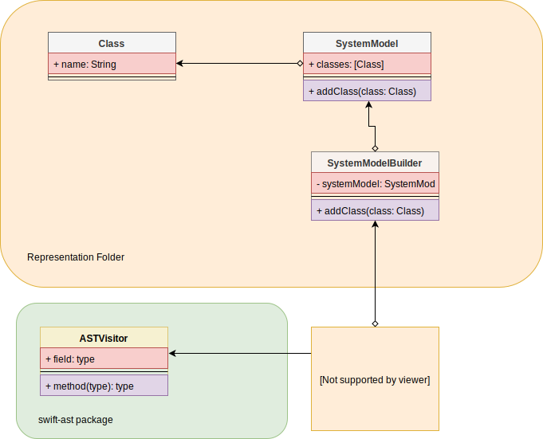

*Contents*
- [Over-arching Systems](#over-arching-systems)
- [Model of System Being Documented](#model-of-system-being-documented)

# Over-arching Systems

SwiftCodeHelper uses AST as its core parsing technology.  Specifically SwiftAST (see https://github.com/yanagiba/swift-ast.git)

# Model of System Being Documented

The system being documented is further modeled using a light-weight set of structs.  These can be found in the Representation folder of the sources.  Generally, the class structure looks like this:

The SystemModel is the actual software system itself.  Its component parts are all members of the model.